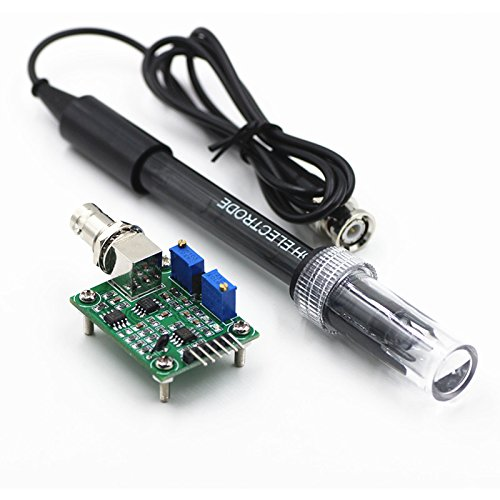

# How to wire up your sensors to the Aduino
## arduino board selection - **Please read first**
Depending on your needs, almost any arduino board can be used, but...
If you want to use water level sensors that will trigger automatic water tank fill, 
or water flow sensor, you will need a board that supports interupts.
Luckily, you don't need to know what they are, you do need to know that the old Arduinos don't have anough of them,
so avoid the Arduino Uno, Nano and mini, all the other should be ok, 
Even more lucky, the cheapest Arduino board currently also fits the bill the most,
the Arduino [Nano Every](https://store.arduino.cc/usa/nano-every-with-headers) (not the old Nano)

## First of all - Power!!
Using a 12V power supply is preferable, since the arduino and most of the external attachments,
like water pump, water full selonoid, lighting, paristaltic pumps and others run on 12V.

It is preferable to use a common power and ground bus, that simplifies the wiring.

The arduino needs 7-20V of power, or you can connect it to a powerd hub together with the Pi,
look at your arduino wiring diagram, and connect the 12V input to the VIn pin, 
and the gnd pin to the ground common bus.

all the sensors get thier power from the arduino 5V pin, so you can create a common bus for that too.

## The sensors

## Analog sensors
### ph
  
The Ph sensor connects to a small controller board that has 3 wires
- VIn/V+/Vcc (red wire) - which connects to the common arduino 5V bus 
- Gnd (black wire) - connects to the common ground bus
- data wire (usualy blue but can be other color) - connects to any of the analog pins on the arduino, (A0 if no code change is wanted)

### TDS/EC sensor
  
The TDS sensor also uses a small controller board with 3 wires
- VIn/V+/Vcc (red wire) - which connects to the common arduino 5V bus 
- Gnd (black wire) - connects to the common ground bus
- data wire (usualy yellow but can be other color) - connects to any of the analog pins on the arduino, (A2 if no code change is wanted)

### Light sensor
  
The light sensor has 4 pins
- VIn/V+/Vcc (red wire) - which connects to the common arduino 5V bus 
- Gnd (black wire) - connects to the common ground bus
- AO - connects to any of the analog pins on the arduino, (A1 if no code change is wanted)
- DO is not used - no need to connect

## Digital sensors
### Water flow sensor
The water flow sensor has 3 wires
- VIn/V+/Vcc (red wire) - which connects to the common arduino 5V bus 
- Gnd (black wire) - connects to the common ground bus
- data wire - connect to any digital input pin **with interupt** on the arduino

### Water level sensor
The water level sensor has 3 wires
- VIn/V+/Vcc (red wire) - which connects to the common arduino 5V bus 
- Gnd (black wire) - connects to the common ground bus
- data wire - connect to any digital input pin **with interupt** on the arduino

## I2C sensors and RTC
The I2C bus is a shared bus, you can either connect all the wires to a common bus - preferably (one for SDA and one for SCL), or daisy chain them.
### RTC
  
The RTC (I use) has 7 pins on one side and 5 mirrored on the other
- VIn/V+/Vcc (red wire) - which connects to the common arduino 5V bus 
- Gnd (black wire) - connects to the common ground bus
- SDA - this is half of the I2C bus, connects to the SDA pin on the arduino
- SCL - this is the second half of the I2C bus, connects to the SCL pin on the arduino
- SQ - not used
- DS - if you have the tempratuse sensor on the RTC board (only some have it - the area circled in red should not be empty), you can connect it to any digital pin on the Arduino
- BAT - not used
except for the SQ and the BAT pins, all pins are mirrored on both sides, you can use either,
you can also connect other sensors to the not used side of the RTC insted of directly to the Arduino (though I could find no use for that)

### Environmental sensor
  
The environmental sensor also connects to the I2C bus and has 4 pins
- VIn/V+/Vcc (red wire) - which connects to the common arduino 5V bus 
- Gnd (black wire) - connects to the common ground bus
- SDA - this is half of the I2C bus, connects to the SDA pin on the arduino
- SCL - this is the second half of the I2C bus, connects to the SCL pin on the arduino